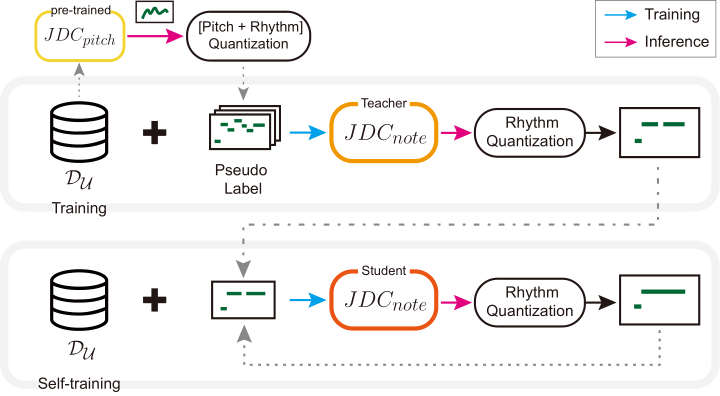
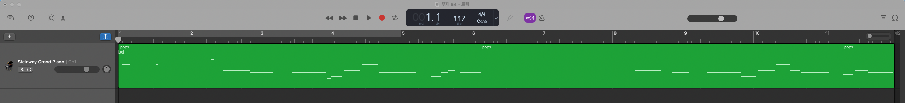

# 使用 ICASSP2022 论文随附源代码 + Google Colab 在线扒人声谱
<a target="_blank" href="https://colab.research.google.com/github/Diamochang/midi-vocal-transcription/blob/main/One_Key_Colab.ipynb">
  
</a>

本仓库提供一个 Jupyter 笔记本，通过特殊设计使其可以在 Google Colab 上一键执行[一篇 ICASSP2022 论文](#原项目简介)随附的完整源代码，实现在线扒人声 MIDI 谱。仓库同时包含上述源代码的最新副本和经调整后的依赖文件（位于`pyproject.toml`），以便执行。（[示例](https://www.bilibili.com/video/BV1iF411F7zq/)）

只需点击上面的徽章，然后点击“代码执行程序”下的“全部运行”，就可以在 Colab 中运行该笔记本。

# 故障报告
建议先阅读[《提问的智慧》](https://github.com/ryanhanwu/How-To-Ask-Questions-The-Smart-Way/blob/main/README-zh_CN.md)，确认理解其内容后再打开 Issues。
## Python 问题
请将能够反映问题的输出截屏或保存在本地，然后打开一个新的 Issue，详细说明故障及复现步骤，并提供上述输出。如果你为了解决该故障修改了笔记本内容，那么需要点一次“代码执行程序”下的“断开连接并删除运行时”，重置远程资源后再点击“全部运行”，如还有故障就把输出截屏或保存，发表 Issue 时一起提供。
## Colab 问题
将 Colab 的报错内容截屏，然后打开一个新的 Issue，详细说明故障及复现步骤，并提供上述截屏。如果你为了解决该故障修改了笔记本内容，那么需要点一次“代码执行程序”下的“断开连接并删除运行时”，重置远程资源后再点击“全部运行”，如还有故障就把报错内容截屏，发表 Issue 时一起提供。

# 原项目简介
论文：Sangeun Kum, Jongpil Lee, Keunhyoung Luke Kim, Taehyoung Kim, Juhan Nam *"Pseudo-Label Transfer from Frame-level to Note-level in a Teacher-student Framework for Singing Transcription from Polyphonic Music"*, ICASSP2022, Singapore <[link](https://ieeexplore.ieee.org/document/9747147)>

## Abstract

Lack of large-scale note-level labeled data is the major obstacle to singing transcription from polyphonic music. We address the issue by using pseudo labels from vocal pitch estimation models given unlabeled data. The proposed method first converts the frame-level pseudo labels to note-level through pitch and rhythm quantization steps. Then, it further improves the label quality through self- training in a teacher-student framework. 



To validate the method, we conduct various experiment settings by investigating two vocal pitch estimation models as pseudo-label generators, two setups of teacher-student frameworks, and the number of iterations in self-training. The results show that the proposed method can effectively leverage large-scale unlabeled audio data and self-training with the noisy student model helps to improve performance. Finally, we show that the model trained with only unlabeled data has comparable performance to previous works and the model trained with addi- tional labeled data achieves higher accuracy than the model trained with only labeled data.

## Demo video
- <[Youtube Link 1](https://www.youtube.com/watch?v=wlD-GAGuj0M "Demo 1: Singing transcription from polpyphonic music")> You&I (IU) 
- <[Youtube Link 2](https://youtu.be/iitOC4vuC8U "Demo 2: Singing transcription from polpyphonic music")> You in my arms (Myung jin Moon)


## Dependencies

- OS: LINUX 
- Programming language: Python 3.6+
- Python Library 
  - Keras 2.7.0 (Deep Learning library)
  - tensorflow 2.5.0 (Deep Learning library)
  - Librosa 0.8.1 (for STFT)  
  - pydub 0.25.1 (for loading audio and resampling)
  - pretty-midi (for handling midi data)
  - Numpy, SciPy

- Hardware
  - 1 GPU : GeForce GTX 3090


## Using STP from the command line
``` 
$ python singing_transcription.py -i ../audio/test.wav  -o ../output

[optional arguments]
  -i path_audio           Path to input audio file. (default: '../audio/pop1.wav')
  -o pathsave             Path to folder for saving .mid file (default: '../output')
  -ot output_type        (optional) Output type: midi or frame-level pitch score(fps) (default: 'midi')
```
- output example: ADC04-pop1.wav
  

# Citation
If you find our work useful, please consider citing our paper.

``` 
@inproceedings{kum2022pseudo,
  title={Pseudo-Label Transfer from Frame-Level to Note-Level in a Teacher-Student Framework for Singing Transcription from Polyphonic Music},
  author={Sangeun Kum, Jongpil Lee, Keunhyoung Luke Kim, Taehyoung Kim, and Juhan Nam},
  booktitle={Proceedings of the IEEE International Conference on Acoustics, Speech and Signal Processing (ICASSP)},
  year={2022}
}
``` 
